# Lua reference

Every function the engine exposes to a script, with what each parameter does, what to set it to, what
it costs, and a picture of the result.

`docs/lua_api.md` is the short version: the shape of the API and its rules. This is the long one, and it
is organised by what you are trying to build rather than by namespace.

## How to read the pictures

Every image on this page is the same 2048 m square at 4 m per sample, exported with the same command and
differing only in the parameter being shown:

```bash
build/Release/bin/terrain_export --script assets/scripts/gallery.lua --param case=<name> --min 0,0 --max 2048,2048 --resolution 4.0 --section 256 --out out/
```

`assets/scripts/gallery.lua` carries one case per image and nothing else, so any of them can be
regenerated or changed. The files committed under `docs/images/lua/` are those exports box-filtered to
half size and 8 bits, which is 2 MB for the set instead of 18.

Grayscale images are heightfields or masks; the caption says the range they are normalised against. The
colour ones are vector outputs, where red, green and blue carry `x`, `y` and `z` remapped from `[-1, 1]`.

Two things to keep in mind when reading a number off this page. **Sample spacing matters**: anything
measured per cell — a talus, a blur radius, a slope — means something different at 1 m than at 8 m, and
the text says so wherever it applies. **Frequency and amplitude are not independent**: a 400 m hill
every 500 m is a spike, and the same 400 m over 5 km is a mountain. §Picking a frequency has the
arithmetic.

---

## 1. The shape of a script

```lua
local function main(params)
    local base = Noises.fBm{ frequency = 0.0002, octaves = 6, amplitude = 400.0, seed = params.seed }
    return {
        height  = { value = base.value, range = { -400, 400 } },
        normals = { value = Terrain.Normals{ input = base.gradient } },
    }
end

return main
```

`main` receives `params` and returns a table of outputs. Building the graph computes nothing: every call
returns a handle immediately, and the engine evaluates once, on the GPU, after the script has run.

| `params` field | Meaning |
| --- | --- |
| `params.seed` | the job seed, from `--seed` |
| `params.resolution` | metres per sample |
| `params.bounds.min`, `.max` | world bounds as `{ x, y, z }`, also as `min_x` … `max_z` |
| `params.<key>` | every `--param key=value`; numeric-looking values arrive as numbers |

Each output is `{ value = <handle>, range = { lo, hi } }`. `range` is required for a scalar output
because that is what the 16-bit file is normalised against; a vector output always remaps `[-1, 1]` and
can be written as a bare handle. Outputs are requested in **name order**, not table order.

### Handles, channels and operators

A handle is one channel of one node.

| Access | Produces |
| --- | --- |
| `h.value` | channel 0, which every op has |
| `h.gradient`, `h.flow` | the op's named second channel, where it has one |
| `h.x`, `h.y`, `h.z`, `h.w` | one component, `Rn -> R1` |
| `a + b`, `a - b`, `a * b`, `a / b`, `-a` | pointwise arithmetic; either side may be a number |

A channel nothing asks for is never computed and never given a buffer, so `Noises.fBm` that is only used
for its value costs exactly one buffer.

### Mappings

| Mapping | What it usually is |
| --- | --- |
| `R2->R1` | heightmap, mask |
| `R2->R2` | gradient, flow field |
| `R2->R3` | normal map |
| `R3->R1` | density field |

Arithmetic is generic when both sides match, and broadcasts an `Rn->R1` over an `Rn->Rm`.

---

## 2. What a graph costs

Three ops read their neighbours: `Filters.Blur`, `Terrain.Gradient` and the two erosions. Their radius
propagates **backwards** to everything that feeds them, so every op upstream computes a border beyond
its own section. That border is the halo, and it is the main thing that decides what a script costs.

| Op | Radius it adds |
| --- | --- |
| `Filters.Blur` | `radius` |
| `Terrain.Gradient` | 1 |
| `Erosion.Thermal` | `iterations` |
| `Erosion.Hydraulic` | `iterations` |

Radii **add** along a chain. A graph ending in `Hydraulic{iterations=24} → Thermal{iterations=12} →
Gradient` has a halo of 37 at the noise, so a 512-sample section evaluates 586² samples instead of 512²,
which is 31% more work. At 200 hydraulic iterations it would be 912² — 3.2 times the work — and the
engine refuses a halo above 255 with a message naming the node.

```
terrain.lua:9: [compile] Noise would need a halo of 400, over the limit of 255; every op between here
and an output adds its radius, and an iterative op contributes one per iteration
```

The practical consequence: **iteration counts are a cost, not a quality dial.** Before raising one, ask
whether a lower count at a coarser resolution gives the same shape.

---

## 3. Generation

### `Noises.fBm`, `Noises.Ridged`, `Noises.Billow`

Fractal noise with its exact analytic gradient, out of the same evaluation as the value. `Noises.Ridged`
and `Noises.Billow` are the same op with a different base function; `Noises.fBm{ kind = "ridged" }` is
the same thing written the other way.

| Key | Type | Default | Valid | Meaning |
| --- | --- | --- | --- | --- |
| `kind` | string | `"simplex"` | `simplex`, `ridged`, `billow` | base function; only on `fBm` |
| `domain` | number | `2` | 2 or 3 | `R2` is `(x, z)`, `R3` is `(x, y, z)` |
| `frequency` | number | `0.002` | `> 0` | cycles per metre: wavelength is `1 / frequency` |
| `octaves` | number | `6` | 1 … 32 | how many scales are summed |
| `lacunarity` | number | `2.0` | `> 0` | frequency multiplier per octave |
| `persistence` | number | `0.5` | `> 0` | amplitude multiplier per octave |
| `amplitude` | number | `1.0` | any | output half-range when `normalize` is set |
| `offset` | number | `0.0` | any | added after accumulation |
| `seed` | number | `0` | any | salt, decorrelates nodes sharing the job seed |
| `normalize` | boolean | `true` | | divide by the sum of amplitudes |

Channel 0 is the value, channel 1 is `gradient` (`R2->R2` or `R3->R3`).

**The three base functions**, all at `frequency = 0.0012`, 6 octaves, over `[-1, 1]`:

| `simplex` | `ridged` | `billow` |
| --- | --- | --- |
|  | 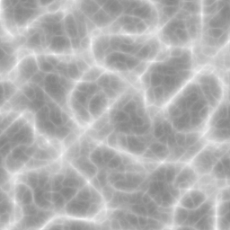 | 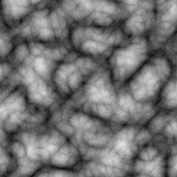 |
| Smooth hills and hollows. The default, and what a base terrain should be | Sharp crests. Note it sits high in the band: ridged is `1 - |n|` in spirit, so its mean is well above zero | Rounded lumps. Useful for dunes, clouds and boulder fields |

#### Picking a frequency

This is the parameter that decides whether the result reads as terrain or as spikes, and it cannot be
chosen without the amplitude. A wave of amplitude `A` and wavelength `L` has a maximum slope of
`2πA/L`. With `lacunarity = 2` and `persistence = 0.5` every octave contributes the **same** slope, so
the whole stack is about `octaves` times that.

Measured at 8 m sampling with `amplitude = 400` and 6 octaves:

| `frequency` | Wavelength | Mean slope | Reads as |
| --- | --- | --- | --- |
| `0.002` | 500 m | 62° | a field of spikes |
| `0.0005` | 2 km | 27° | steep alpine |
| `0.0002` | 5 km | 11° | mountain terrain |

Rule of thumb: **wavelength of the base octave ≳ 10 × amplitude**. For 400 m of relief that is a 4 km
wavelength, `frequency = 0.00025`.

| `frequency = 0.0004` | `0.0012` | `0.004` |
| --- | --- | --- |
| 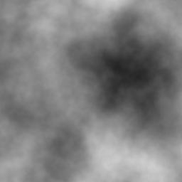 |  | 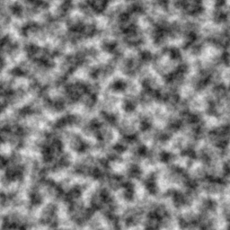 |

#### `octaves`

Each octave adds detail at half the wavelength and half the amplitude. Past the point where an octave's
wavelength is about twice the sample spacing it adds nothing but aliasing.

| 1 | 3 | 8 |
| --- | --- | --- |
| 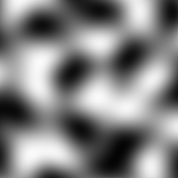 | 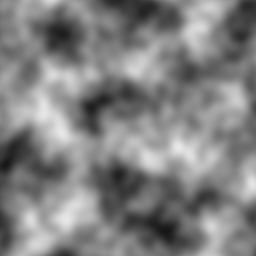 |  |

**Useful ceiling:** `octaves ≤ log2(1 / (frequency × 2 × resolution))`. At `frequency = 0.0012` and 4 m
per sample that is 6.7, so 8 octaves is already past the point of return — compare the last two images.

| Use case | `octaves` |
| --- | --- |
| A mask or a large-scale shape | 2–3 |
| A base terrain for export at 1–4 m | 5–7 |
| Detail for a close-up at sub-metre resolution | 8–10 |

#### `persistence` and `lacunarity`

`persistence` is roughness: how much each successive octave contributes.

| 0.3 | 0.5 | 0.8 |
| --- | --- | --- |
|  |  | 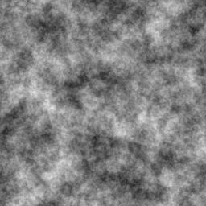 |

| Value | Result |
| --- | --- |
| 0.3–0.4 | smooth, rolling. Good under erosion, which adds its own detail |
| 0.5 | the default, and the point where every octave contributes equal slope |
| 0.7–0.9 | harsh and noisy. Rarely what a heightfield wants; fine for a detail layer multiplied into a mask |

`lacunarity` is the frequency step. 2.0 is the default because it is the value at which octaves tile the
spectrum without gaps or overlap; moving off it changes how "organised" the result looks.

| 1.5 | 2.0 | 3.5 |
| --- | --- | --- |
| 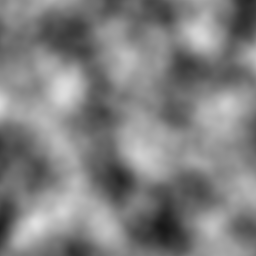 |  | 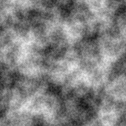 |

Below 2 the octaves overlap and the result looks blurred and self-similar; above 2.5 they separate and
the result looks like two unrelated layers stacked. Use 1.9–2.1 unless you want that effect; an
irrational-ish value such as 2.137 avoids octaves lining up into visible grid artefacts.

#### `normalize`, `amplitude` and `offset`

With `normalize = true` the octave sum is divided by the sum of the amplitudes, so the output band is
`offset ± amplitude` and you can declare an export range with confidence. With it cleared, `amplitude`
is the **first octave's** amplitude and the total is larger and harder to predict.

Leave it set unless you are reproducing a reference implementation.

#### Combines with

`Terrain.Normals{ input = base.gradient }` for free exact normals · `Masks.Slope` on the gradient to
select by steepness · `Combine.Blend` to layer a second noise · `Curves.*` to shape the distribution ·
the erosions to turn it into landforms.

#### Example

```lua
-- A base terrain with 400 m of relief over a 5 km base wavelength, and its exact normals.
local base = Noises.fBm{
    frequency   = 0.0002,
    octaves     = 6,
    lacunarity  = 2.0,
    persistence = 0.45,
    amplitude   = 400.0,
    seed        = params.seed,
}

return {
    height  = { value = base.value, range = { -400, 400 } },
    normals = { value = Terrain.Normals{ input = base.gradient } },
}
```

### `Terrain.Const`

| Key | Default | Meaning |
| --- | --- | --- |
| `domain` | `2` | 2 or 3 |
| `value` | `0.0` | the constant |

Produces `Rn -> R1`. Mostly you do not need it: a bare number works wherever a field is expected, and
the compiler folds a constant operand into the consuming kernel as an immediate, saving a dispatch and
a buffer. Reach for it when you need a constant as the `a` or `b` of a `Combine.Blend`, where both
sides must be handles.

### `Terrain.Coords`

| Key | Default | Meaning |
| --- | --- | --- |
| `domain` | `2` | 2 or 3 |

The **integer sample coordinate** of each sample, as `Rn -> Rn`. This is how a script builds anything
positional — an island falloff, a linear gradient, a region mask.

Two traps, and both bite the first time:

* **It is in samples, not metres.** A sample at world x = 2048 m with `--resolution 4` comes out as 512.
  Multiply by `params.resolution` to work in metres, and do it explicitly, because a script that forgets
  describes different terrain at every resolution.
* **On an `R2->R2`, world z is `.y`.** The component accessors are positional — `.x` is component 0,
  `.y` is component 1 — and an `R2->R2` has only two components. `Terrain.Coords{ domain = 2 }.z` is an
  error that says `R2->R2 has 2 component(s), component 2 was requested`. In `R3` the three components
  are `.x`, `.y`, `.z` as you would expect.

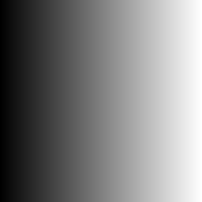
*`Terrain.Coords{}.x` over `[0, 512]` at 4 m per sample across a 2048 m square: 0 on the left, 511 on
the right. Sample indices, not metres.*

#### Example: a circular island falloff

```lua
local r      = params.resolution
local p      = Terrain.Coords{ domain = 2 }
-- Samples to metres, and `.y` for world z: an R2->R2 has two components, so `.z` would be an error.
local centre = 1024.0
local dx     = p.x * r - centre
local dz     = p.y * r - centre
local dist2  = dx * dx + dz * dz                   -- squared metres from the centre

-- Squared, because `^` is not one of the overloaded operators and there is no square-root op. Work
-- in squared distance and square the bounds instead: it is exact and it is one dispatch cheaper.
local inner, outer = 300.0, 900.0
local land = Curves.Smoothstep{ input = -dist2, min = -(outer * outer), max = -(inner * inner) }
local base = Noises.fBm{ frequency = 0.002, amplitude = 400.0, offset = 200.0 }

return { height = { value = base.value * land - 200.0, range = { -600, 600 } } }
```

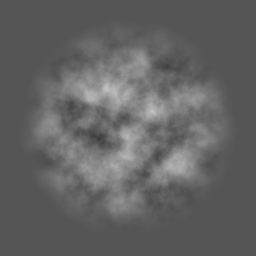
*The result: terrain inside the falloff, flat sea outside, over `[-600, 600]`.*

Note `Smoothstep` with a negated input and negated bounds: the curve ramps upward, so to fall off with
distance you feed it the negative.

---

## 4. Analysis

### `Terrain.Normals`

| Key | Default | Meaning |
| --- | --- | --- |
| `input` | required | a gradient, `R2->R2` |
| `vertical_scale` | `1.0` | multiplies the slope before normalising |

Takes a **gradient**, not a height, and produces `R2->R3`. Given a handle whose node exposes a gradient
channel it resolves it, so `Terrain.Normals{ input = base }` works for a noise handle.

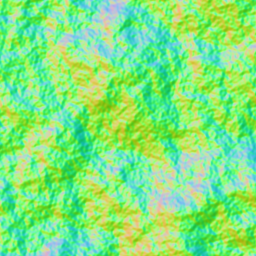
*Normals of a steep base. Green dominates because `y` is up; red and blue carry `x` and `z`.*

`vertical_scale` above 1 exaggerates relief, which is what you want when a renderer lights a heightfield
whose vertical exaggeration differs from the data. Below 1 flattens it.

| Use case | `vertical_scale` |
| --- | --- |
| Export to match the heightmap exactly | `1.0` |
| A game engine that draws the terrain at 2× vertical scale | `2.0` |
| Taking the edge off a noisy field for lighting only | `0.5` |

#### Combines with

Always with a gradient: either a noise node's exact `.gradient`, or `Terrain.Gradient` for a field that
has been through blends, curves or erosion.

```lua
-- Exact, and free: the same dispatch that produced the value produced this.
Terrain.Normals{ input = base.gradient }

-- Measured, radius 1, for a height that no longer has a closed form.
Terrain.Normals{ input = Terrain.Gradient{ input = eroded } }
```

### `Terrain.Gradient`

| Key | Default | Meaning |
| --- | --- | --- |
| `input` | required | `Rn -> R1` |

Central differences, producing `Rn -> Rn`. **Radius 1, so it puts a halo on everything upstream**, and
it is the only op in the engine that is not analytic.

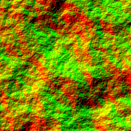
*The gradient of a heightfield: `x` in red, `z` in green, remapped from `[-1, 1]`.*

Use it only when there is no closed form left to differentiate — after erosion, after a blend, after a
curve. For a noise node, `.gradient` is exact and costs nothing extra.

### `Masks.Slope`

| Key | Default | Meaning |
| --- | --- | --- |
| `input` | required | a gradient, `R2->R2` |
| `min` | `0.0` | slope at which the mask starts to rise |
| `max` | `1.0` | slope at which it reaches 1; must exceed `min` |

Produces `R2->R1` in `[0, 1]`: 0 where the terrain is flatter than `min`, 1 where it is steeper than
`max`, smooth in between. Slope is `m/m` — `tan(angle)`, not degrees. `min = 0.577` is 30°, `1.0` is 45°.

**Feed it the gradient of a smooth field, not of your base terrain.** Differentiating an fBm weights each
octave by its frequency, so the gradient of a six-octave field is dominated by the finest octave and the
mask flickers from sample to sample. Measured on the same graph at 8 m sampling, a blend driven by a
six-octave mask has a mean slope of 38°, and by a three-octave mask 13.6°, with the relief unchanged.

| Six-octave gradient | Three-octave gradient | Narrow band, three octaves |
| --- | --- | --- |
| 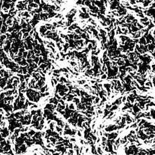 | 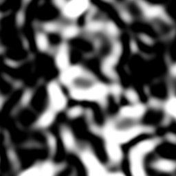 | 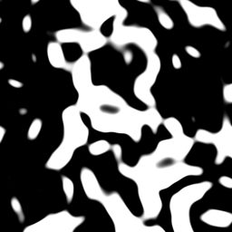 |
| `min = 0.3, max = 1.1` — flickers | the same thresholds, usable | `min = 0.6, max = 0.75` — a sharper selection |

#### Choosing thresholds

They have to bracket the slope your terrain actually has. Measure it rather than guess: export
`Terrain.Normals{...}.y` and convert, or just try `min`/`max` and look. For the base in these pictures
the slope distribution is p10 0.27, p50 0.69, p90 1.23, which is why `0.3 … 1.1` spans it.

| Use case | `min` | `max` |
| --- | --- | --- |
| Rock on cliffs, grass elsewhere | p50 | p90 |
| Snow only on gentle ground (invert with `1 - mask`) | p10 | p50 |
| A hard selection of the steepest ground | p80 | p85 |

#### Combines with

`Combine.Blend` as the `mask` · multiplied into another mask with `*` · `Curves.Power` to bias it
towards 0 or 1 without moving the thresholds.

---

## 5. Composition

### `Combine.Blend`

| Key | Default | Meaning |
| --- | --- | --- |
| `a`, `b` | required | same mapping |
| `mask` | required | `Rn -> R1` |

Linear interpolation: `a` where the mask is 0, `b` where it is 1. The mask is not clamped, so a mask
outside `[0, 1]` extrapolates — use `Curves.Clamp` if that is a risk.

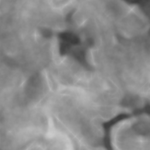
*Smooth base blended toward ridged peaks by a slope mask, over `[-400, 400]`.*

The canonical use is layering: a smooth base everywhere, something sharper where the terrain is already
steep, so peaks sit on slopes instead of floating over flat ground.

### `Combine.Min`, `Combine.Max`

| Key | Meaning |
| --- | --- |
| `a`, `b` | the two fields |

| `Combine.Min` | `Combine.Max` |
| --- | --- |
| 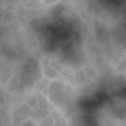 | 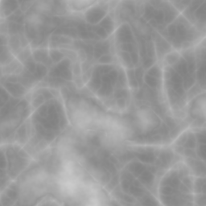 |

`Max` keeps whichever field is higher, which unions two landforms — add a plateau to a mountain range
without cutting into it. `Min` intersects, which is how you carve: a canyon field `Min`-ed into a base
removes material wherever the canyon is lower. Both leave a crease where the two surfaces cross; soften
it with a small `Filters.Blur` if it reads as an edge.

#### Example: a plateau that never sinks below the terrain

```lua
local base    = Noises.fBm{ frequency = 0.0003, amplitude = 300.0 }
local plateau = Terrain.Const{ value = 120.0 }
return { height = { value = Combine.Max{ a = base.value, b = plateau }, range = { -300, 300 } } }
```

---

## 6. Value shaping

All four are pointwise, cost one dispatch and add no halo.

| Key | `Clamp` | `Remap` | `Power` | `Smoothstep` |
| --- | --- | --- | --- | --- |
| `input` | required | required | required | required |
| `min` | `0.0`, the floor | `0.0`, output minimum | — | `0.0`, where the ramp starts |
| `max` | `1.0`, the ceiling | `1.0`, output maximum | — | `1.0`, where it ends; must exceed `min` |
| `exponent` | — | — | `1.0`, in `[0, 64]` | — |

| Input | `Clamp{-0.3, 0.3}` | `Remap{0, 1}` |
| --- | --- | --- |
|  | 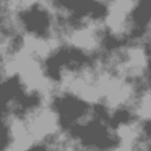 | 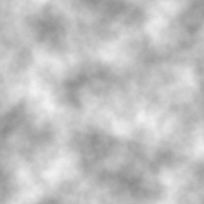 |

| `Power{0.5}` | `Power{3.0}` | `Smoothstep{-0.2, 0.2}` |
| --- | --- | --- |
| 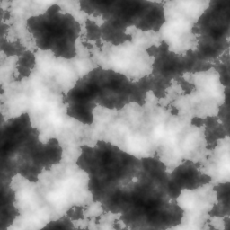 | 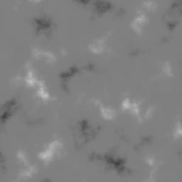 | 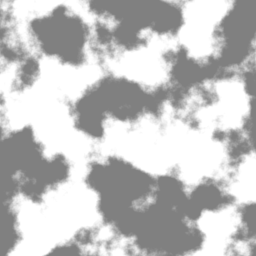 |

**`Clamp`** flattens everything past its bounds into plateaus and floors. Use it to put a hard sea level
under a terrain, or to stop erosion's overshoot from widening your export range.

**`Remap`** takes the canonical `[-1, 1]` that a normalised noise produces into `[min, max]`. It assumes
that input band — it is `min + (max - min) × (v × 0.5 + 0.5)` — so feeding it something else shifts the
result. For an arbitrary field, scale with arithmetic instead.

**`Power`** biases a distribution while preserving sign, so a signed field stays signed under an even
exponent. Exponent below 1 pushes values towards the extremes (more area at high and low); above 1 pulls
them towards zero, which on a mask means "only the strongest parts survive".

| Use case | `exponent` |
| --- | --- |
| Make a mask more selective | 2–4 |
| Make a mask more generous | 0.3–0.6 |
| Deepen valleys without touching peaks (on a `[0,1]` height) | 1.5–2.5 |

**`Smoothstep`** is the one to reach for when you want a mask out of a scalar: 0 below `min`, 1 above
`max`, with a smooth transition. It is how you turn a height, a distance or a dot product into a weight.

```lua
-- Everything above 600 m is snow, with a 150 m transition.
local snow = Curves.Smoothstep{ input = height, min = 600.0, max = 750.0 }
```

---

## 7. Filtering

### `Filters.Blur`

| Key | Default | Valid | Meaning |
| --- | --- | --- | --- |
| `input` | required | | any mapping |
| `radius` | `1` | 1 … 32 | radius in **samples**, not metres |

| `radius = 1` | `8` | `32` |
| --- | --- | --- |
|  |  |  |

Two things to watch.

**The radius is in samples**, so the same script blurs a different distance at a different resolution.
If you want a blur of `D` metres, write `radius = math.max(1, math.floor(D / params.resolution))`.

**It is the most expensive halo in the engine per unit of effect**: radius 32 adds 32 to the halo of
everything upstream, which on a 512 section is 576² instead of 512², a 27% surcharge for one op. Prefer
lowering the noise's `octaves` or `persistence` over blurring the detail away afterwards — it is free,
and it does not smear the large scales along with the small.

#### Use cases

| Use case | `radius` |
| --- | --- |
| Softening the crease left by `Combine.Min`/`Max` | 1–2 |
| Smoothing a mask so a blend transition is not pixelated | 3–8 |
| Building a large-scale "shape" field to drive a mask | 16–32, or better, a 2-octave noise for free |

---

## 8. Vectors

### `Vec.Combine`

Takes a positional list of 2 to 4 scalars and builds an `Rn -> Rm`.

```lua
local p    = Terrain.Coords{ domain = 2 }
local warp = Vec.Combine{ p.x * 0.5, p.y * 0.5 }   -- `.y` is world z on an R2->R2
```

Component access is the other direction: `h.x`, `h.y`, `h.z`, `h.w` pull one component out as `Rn -> R1`.

---

## 9. Erosion

Both are iterative, and both charge their iteration count as halo. Both take an `Rn -> R1` height.

> **Note on units.** Both ops currently measure slope as a height difference **per cell**, not per
> metre, so `talus` and the hydraulic capacity term mean different things at different sample spacings.
> Measured on the sample script at 8 m and 16 m over the same world positions, the noise alone is
> bit-identical and the eroded result differs by 8.0 m on average. Until that is fixed, derive `talus`
> from the resolution: `talus = params.resolution * math.tan(math.rad(angle))`.

### `Erosion.Thermal`

Material slides downhill wherever the drop to a neighbour exceeds the talus. Conservative: what a cell
gives away, its neighbours receive.

| Key | Default | Valid | Meaning |
| --- | --- | --- | --- |
| `input` | required | | `Rn -> R1` |
| `iterations` | `16` | ≥ 1 | passes, and the influence radius |
| `talus` | `0.02` | ≥ 0 | drop per cell below which nothing moves |
| `strength` | `0.25` | `(0, 0.5]` | fraction of the excess moved per iteration |

| No erosion | 8 iterations | 32 | 96 |
| --- | --- | --- | --- |
|  | 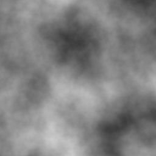 |  |  |

All three at `talus = 4 × tan(35°) = 2.80` and `strength = 0.3`, at 4 m per sample.

`strength` above 0.5 is rejected, and the reason is stability rather than taste: a cell can overshoot its
neighbour and the field oscillates instead of settling.

| Use case | `iterations` | `talus` (at spacing `r`) | `strength` |
| --- | --- | --- | --- |
| Take the edge off noise, cheaply | 4–8 | `r × tan(40°)` | 0.3 |
| Talus slopes and scree below cliffs | 24–48 | `r × tan(33°)` | 0.3 |
| Settle the spoil left by hydraulic erosion | 8–16 | `r × tan(35°)` | 0.25 |
| A heavily weathered, rounded landscape | 64–128 | `r × tan(25°)` | 0.4 |

A lower talus erodes more, because more of the terrain is above the threshold. A high iteration count
with a high talus does almost nothing; a low talus with few iterations rounds only the sharpest edges.

### `Erosion.Hydraulic`

Rain, flow, sediment transport, evaporation. Carves channels and deposits fans.

| Key | Default | Valid | Meaning |
| --- | --- | --- | --- |
| `input` | required | | `Rn -> R1` |
| `iterations` | `32` | ≥ 1 | passes, and the influence radius |
| `rain` | `0.02` | ≥ 0 | water added per cell per iteration |
| `evaporation` | `0.05` | `[0, 1)` | fraction of water lost per iteration |
| `capacity` | `4.0` | ≥ 0 | sediment a unit of flow holds per unit of slope |
| `erosion_rate` | `0.3` | `(0, 1]` | how fast a shortfall is taken from the bed |
| `deposition` | `0.3` | `(0, 1]` | how fast an excess is laid back down |
| `flow_rate` | `0.15` | `(0, 0.25]` | fraction of a surface drop that moves per iteration |

| No erosion | 8 iterations | 32 |
| --- | --- | --- |
|  |  | 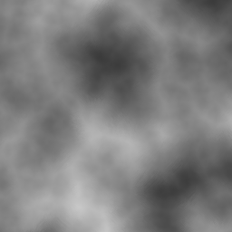 |

**`rain` is the parameter that decides whether anything happens.** The total work the water can do is
proportional to the total rainfall, and the default of 0.02 over 32 iterations is 0.64 m of water across
hundreds of metres of relief — about one metre of bed moved, which is invisible. Measured on a 400 m
terrain, 24 iterations at 8 m sampling:

| `rain` | Relief after | What you see |
| --- | --- | --- |
| 0.02 | 358 m (from 391) | essentially unchanged |
| 0.2 | 350 m | channels appear |
| 0.5 | 338 m | a drainage network |
| 10 | 341 m | the same: the op saturates, because a cell may not cut below its lowest neighbour |

So **0.2–0.5 is the working range**, and raising it further is wasted.

`flow_rate` above 0.25 is rejected: the four outflows of a cell could exceed the water it holds and the
scheme stops being stable.

| Use case | `iterations` | `rain` | `capacity` | Notes |
| --- | --- | --- | --- | --- |
| A hint of drainage, cheap | 8–12 | 0.3 | 4 | halo 12 is affordable on any section |
| Visible valleys and fans | 24–32 | 0.5 | 6 | the general-purpose setting |
| Deep, mature channels | 48–64 | 0.5 | 8–12 | halo 64 is 29% more work on a 512 section |
| Arid, little deposition | 24 | 0.3 | 3 | raise `evaporation` to 0.15 |

#### The `flow` channel

Channel 1 is `flow`: water on `x`, sediment on `y`, as they stood after the last iteration. A wetness map
and a sediment map, which is what a renderer wants for putting rock against silt.

| Water (`flow.x`) | Sediment (`flow.y`) |
| --- | --- |
| 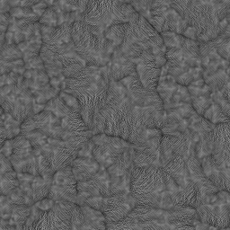 | 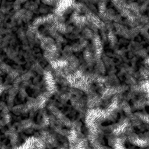 |

Asking for it costs a second section buffer and the bandwidth to fill it; a script that only wants a
height pays for neither. You may ask for `flow` **without** asking for the height.

```lua
local base   = Noises.fBm{ frequency = 0.0006, octaves = 6, amplitude = 300.0 }
local carved = Erosion.Hydraulic{ input = base.value, iterations = 32, rain = 0.5, capacity = 6.0 }
return {
    height   = { value = carved, range = { -400, 400 } },
    wetness  = { value = carved.flow.x, range = { 0, 20 } },
    sediment = { value = carved.flow.y, range = { 0, 40 } },
}
```

### Water first, then thermal

The two combine in one order: hydraulic erosion cuts channels and piles the spoil at unnatural angles,
and thermal erosion settles that spoil into talus slopes.


*`Hydraulic{32, rain = 0.5}` then `Thermal{16, talus = 4 × tan(35°)}`.*

Their radii add: this chain has a halo of 48 before anything else in the graph is counted.

---

## 10. Recipes

### A complete terrain

```lua
local function main(params)
    local amplitude = params.amplitude or 400.0
    local sea       = params.sea_level or 0.0
    local wear      = params.erosion or 24
    local r         = params.resolution

    -- Base: wavelength ten times the amplitude, so the slopes are terrain and not spikes.
    local base = Noises.fBm{
        frequency = 0.0002, octaves = 6, lacunarity = 2.0, persistence = 0.5,
        amplitude = amplitude, offset = sea, seed = params.seed,
    }

    -- The mask reads a three-octave gradient, not the base's own: the gradient of a six-octave field
    -- is dominated by its finest octave and the mask would flicker sample to sample.
    local shape = Noises.fBm{
        frequency = 0.0002, octaves = 3, amplitude = amplitude, offset = sea, seed = params.seed,
    }
    local ridges = Noises.Ridged{
        frequency = 0.0004, octaves = 4, amplitude = amplitude * 0.6, offset = sea,
        seed = params.seed + 1,
    }
    local blended = Combine.Blend{
        a = base.value, b = ridges.value,
        mask = Masks.Slope{ input = shape.gradient, min = 0.3, max = 1.1 },
    }

    -- Water cuts, then thermal settles the spoil. Talus from the resolution, so the same script
    -- describes the same terrain at any sample spacing.
    local carved = Erosion.Hydraulic{
        input = blended, iterations = wear, rain = 0.5, capacity = 6.0,
    }
    local settled = Erosion.Thermal{
        input = carved, iterations = wear // 2,
        talus = r * math.tan(math.rad(35.0)), strength = 0.3,
    }

    local low, high = sea - amplitude * 1.5, sea + amplitude * 2.0
    local height    = Curves.Clamp{ input = settled, min = low, max = high }

    return {
        height  = { value = height, range = { low, high } },
        normals = { value = Terrain.Normals{ input = Terrain.Gradient{ input = height } } },
    }
end

return main
```

### A rock-versus-grass mask

```lua
local shape = Noises.fBm{ frequency = 0.0002, octaves = 3, amplitude = 400.0 }
local rock  = Masks.Slope{ input = shape.gradient, min = 0.5, max = 0.9 }
-- Sharper selection without moving the thresholds.
local tight = Curves.Power{ input = rock, exponent = 2.0 }
return { rock = { value = tight, range = { 0, 1 } } }
```

### Snow above an altitude, but not on cliffs

```lua
local base  = Noises.fBm{ frequency = 0.0002, amplitude = 400.0 }
local alt   = Curves.Smoothstep{ input = base.value, min = 150.0, max = 300.0 }
local steep = Masks.Slope{ input = base.gradient, min = 0.6, max = 0.9 }
local snow  = alt * (1.0 - steep)
return { snow = { value = snow, range = { 0, 1 } } }
```

### A domain warp

```lua
local r    = params.resolution
local p    = Terrain.Coords{ domain = 2 }
local wx   = Noises.fBm{ frequency = 0.0005, amplitude = 300.0, seed = 7 }
-- There is no node that samples a field at displaced coordinates, so a warp is built by feeding
-- displaced coordinates into something that is already a function of position. This warps a ramp.
local ramp = (p.x * r + wx.value) * 0.001
return { warped = { value = ramp, range = { 0, 4 } } }
```

---

## 11. Errors

Every binding reads the calling line out of the Lua stack before it touches the graph, so a failure is
reported where it was written.

```
terrain.lua:12: [script] Noises.fBm does not take 'persistance'; it accepts domain, kind, frequency, ...
terrain.lua:14: [validation] Normals expects R2->R2 input, got R2->R1
```

| Stage | Meaning |
| --- | --- |
| `[script]` | a binding rejecting its own arguments: unknown key, wrong type, out of range |
| `[validation]` | a graph builder rejecting a mapping |
| `[compile]` | the compiler: usually a halo over the limit |

An unknown key is an error, never silently ignored, and the message lists the keys the op does accept.

## 12. What a script cannot do

Only `base`, `math`, `string` and `table` are opened. There is no `io`, no `os`, no `package` and no
`require`, so a script cannot read files, start processes or load C modules. It also cannot branch on
terrain data, because none exists while the script runs: a handle is a promise, not a value.
